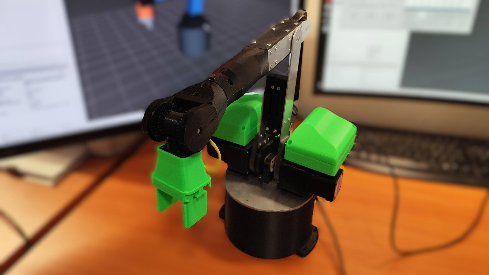

# Pico 6-DOF robot firmware

Firmware and a Python desktop client for controlling the 6-DOF robot. The
firmware is configured for a Raspberry Pi Pico W and communicates with the
client over USB serial at 115200 baud.

Blog post about the robot: https://techniccontroller.com/diy-6dof-robot-arm-a-low-cost-design-with-rp2040-and-ros-2/



## Python client

Python 3 and `venv` are required. On Debian/Ubuntu, install the system packages
first (Tk is used by PySimpleGUI):

```bash
sudo apt install python3-venv python3-tk
```

From the repository root, create a virtual environment and install the client
dependencies:

```bash
python3 -m venv client_python/.venv
source client_python/.venv/bin/activate
python -m pip install --upgrade pip
python -m pip install -r client_python/requirements.txt
```

On Windows, activate the environment with:

```powershell
client_python\.venv\Scripts\Activate.ps1
```

Connect the Pico over USB, then start the client:

```bash
python client_python/client.py
```

Select the Pico's serial port in the connection window. On Linux, the user may
need permission to access serial devices (commonly membership in the `dialout`
group).

## Build and upload the firmware

The recommended workflow is Visual Studio Code with the official
[Raspberry Pi Pico extension](https://marketplace.visualstudio.com/items?itemName=raspberry-pi.raspberry-pi-pico)
(`raspberry-pi.raspberry-pi-pico`). It supplies and configures the Pico SDK,
ARM toolchain, CMake, Ninja, and upload/debug tools. This repository already
recommends the extension when opened in VS Code.

1. Open the repository root in VS Code and install the recommended extensions.
2. Allow the Pico extension to install its SDK and toolchain when prompted.
3. Use the **Compile** button in the VS Code status bar to configure and build
   the project.
4. Connect the Pico W over USB. For the first upload, hold **BOOTSEL** while
   connecting it so that it appears as a USB drive.
5. Use the Pico extension's **Run** button to upload and start the firmware.

The generated firmware is `build/pico_6dof-robot_firmware.uf2`. If automatic
upload is unavailable, copy this file to the `RPI-RP2` USB drive presented by a
Pico started in BOOTSEL mode; it will reboot into the firmware automatically.

